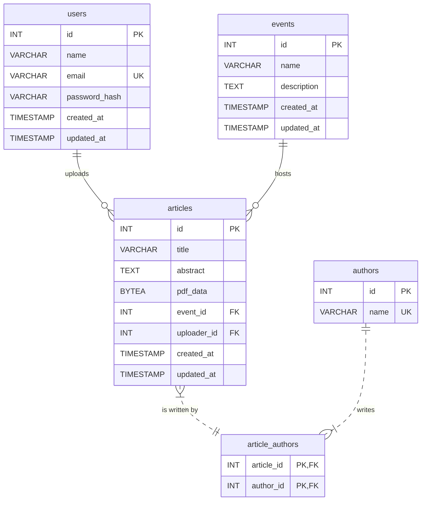

# TP1 - Biblioteca Digital de Artigos

Esse repositório contém o tp 1 da disciplina de engenharia de software, que consiste em implementaruma biblioteca digital de artigos, trabalhando em time utilizando a metodologia ágil SCRUM.

---

## 👥 Equipe

| Nome                 | Papel      | GitHub |
|----------------------|------------|--------|
| Gustavo Luiz    | Frontend  | [@Gustavo](https://github.com/Gustav0Luiz) |
| Leonardo Romano | Backend    | [@LeoRoms](https://github.com/LeoRoms) |
| Vinicius de Alcantara| Backend - banco de dados  | [@vini-alg](https://github.com/vini-alg) |
| Arthur Guimarães  | Backend    | [@Arthur](https://github.com/arthurguimaraesferreira) |

---
## 🛠 Tecnologias Utilizadas

### Frontend
- **Frameworks:** Next.js  
- **Bibliotecas:** ReactJS, TailwindCSS 

### Backend
- **Frameworks:** Express.js  
- **Bibliotecas:** Node.js,  

### Banco de Dados
- **SGBD:** PostgreSQL  

### Agente de IA 
- Cursor/Windsurf

### Outras Ferramentas
- **Controle de versão:** Git + GitHub  
- **Gerenciamento de dependências:** npm    
---

## Esquema do Banco de Dados

A estrutura do banco de dados foi projetada para suportar as funcionalidades da aplicação, incluindo o gerenciamento de eventos, artigos, autores e usuários. Abaixo está o Diagrama de Entidade-Relacionamento (ERD) que representa as tabelas e suas conexões.

