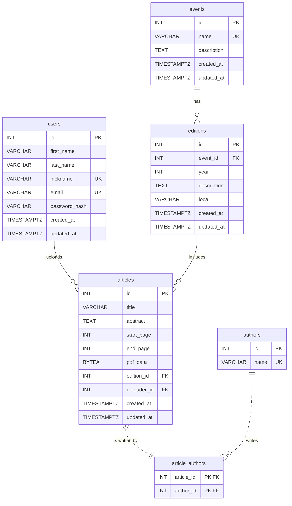
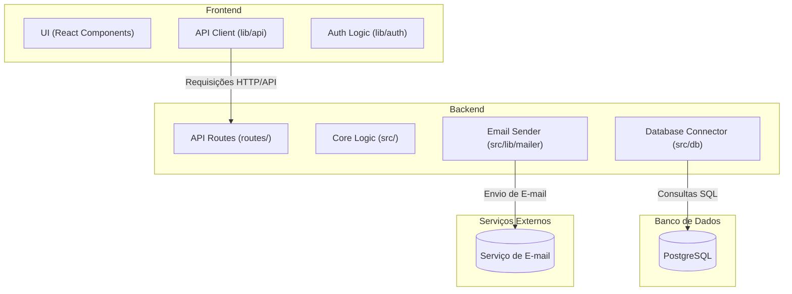
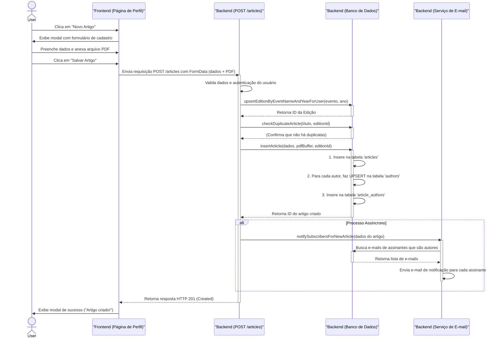

# TP1 - Biblioteca Digital de Artigos

Esse repositório contém o tp 1 da disciplina de engenharia de software, que consiste em implementaruma biblioteca digital de artigos, trabalhando em time utilizando a metodologia ágil SCRUM.

---

## 👥 Equipe

| Nome                 | Papel      | GitHub |
|----------------------|------------|--------|
| Gustavo Luiz    | Frontend  | [@Gustavo](https://github.com/Gustav0Luiz) |
| Leonardo Romano | Backend    | [@LeoRoms](https://github.com/LeoRoms) |
| Vinicius de Alcantara| Backend - banco de dados  | [@vini-alg](https://github.com/vini-alg) |
| Arthur Guimarães  | Backend    | [@Arthur](https://github.com/arthurguimaraesferreira) |

---
## 🛠 Tecnologias Utilizadas

### Frontend
- **Frameworks:** Next.js  
- **Bibliotecas:** ReactJS, TailwindCSS 

### Backend
- **Frameworks:** Express.js  
- **Bibliotecas:** Node.js,  

### Banco de Dados
- **SGBD:** PostgreSQL  

### Agente de IA 
- Cursor/Windsurf

### Outras Ferramentas
- **Controle de versão:** Git + GitHub  
- **Gerenciamento de dependências:** npm    
---

## Esquema do Banco de Dados

A estrutura do banco de dados foi projetada para suportar as funcionalidades da aplicação, incluindo o gerenciamento de eventos, artigos, autores e usuários. Abaixo está o Diagrama de Entidade-Relacionamento (ERD) que representa as tabelas e suas conexões.



---

## Arquitetura do Sistema

O sistema segue uma arquitetura em camadas distribuídas, projetada para separar as responsabilidades e facilitar a manutenção.



---

## Diagrama de Sequência: Publicação de Artigo

O diagrama abaixo ilustra o fluxo de interações para a publicação de um novo artigo no sistema, desde a ação do usuário no frontend até a notificação por e-mail no backend.




## 🚀 Como Executar o Projeto

### Pré-requisitos
- Node.js (versão 18 ou superior)
- PostgreSQL
- npm


O backend estará rodando em: `http://localhost:4000`

O frontend estará rodando em: `http://localhost:3000`

### 4. Testar as Conexões

Acesse `http://localhost:3000/test-connection` para verificar se:
- ✅ Frontend está se comunicando com o Backend
- ✅ Backend está conectado ao Banco de Dados
- ✅ API está funcionando corretamente

### 5. Ordem de Execução

**Execute nesta ordem:**

1. **Banco de dados primeiro:**
   ```bash
   sudo systemctl start postgresql
   ```

2. **Backend em segundo:**
   ```bash
   cd backend && npm run dev
   ```

3. **Frontend por último:**
   ```bash
   cd frontend && npm run dev
   ```

### 📁 Estrutura do Projeto

```
tpes2/
├── backend/           # API Express.js
│   ├── src/
│   │   ├── routes/    # Rotas da API
│   │   └── index.js   # Servidor principal
│   ├── .env           # Variáveis de ambiente
│   └── package.json
├── frontend/          # Aplicação Next.js
│   ├── src/
│   │   ├── app/       # Páginas e componentes
│   │   └── lib/       # Utilitários (API client)
│   ├── .env           # Variáveis de ambiente
│   └── package.json
└── schema.sql         # Schema do banco de dados
```

### 🔧 Comandos Úteis

```bash
# Parar todos os processos
Ctrl + C (em cada terminal)

# Verificar se o PostgreSQL está rodando
sudo systemctl status postgresql

# Acessar o banco diretamente
psql -U postgres -d vlib

# Ver logs do backend
cd backend && npm run dev

# Buildar para produção
cd frontend && npm run build
cd backend && npm start
```

---


## Backlog das Histórias

### História #1: Como administrador, eu quero cadastrar (editar, deletar) um evento  
*(Exemplo: Simpósio Brasileiro de Engenharia de Software)*  

**Tarefas e responsáveis:**  
- Instalar dependências iniciais do projeto (Node.js, Express, Postgres, bibliotecas de apoio) [Arthur, Gustavo, Leonardo e Vinicius]  
- Criar as tabelas do banco de dados para eventos (tabela `events`) [Vinicius]  
- Implementar no backend a API para cadastrar evento no banco de dados (rota `POST /events`) [Arthur]  
- Implementar no backend a API para listar eventos (rota `GET /events`) [Arthur]  
- Implementar no backend a API para editar evento (rota `PATCH /events/:id`) [Leonardo]  
- Implementar no backend a API para deletar evento (rota `DELETE /events/:id`) [Leonardo]  
- Integrar a API com o banco de dados [Arthur]  
- Implementar a tela inicial do sistema (frontend) [Gustavo]  
- Implementar no frontend o fluxo de criação e listagem de eventos [Gustavo]  
- Implementar no frontend o fluxo de edição e exclusão de eventos [Gustavo]  
- Testar cadastro, edição e exclusão de eventos fim a fim (frontend + backend + banco) [Gustavo]  


### História #4: Como administrador, eu quero cadastrar artigos em massa, a partir de um arquivo bibtex, com dados de vários artigos  

**Tarefas e responsáveis:**  
- Criar no banco de dados as tabelas necessárias para artigos e autores (articles, authors, editions, article_authors) [Vinicius]  
- Implementar no backend a rota `POST /articles/bulk-bibtex` [Leonardo]  
- Implementar no backend o parser de arquivos `.bib` para extrair título, autores, ano e páginas [Leonardo]  
- Implementar no backend a lógica de associar arquivos PDF a cada entrada do BibTeX [Leonardo]  
- Garantir consistência entre ano do artigo e ano da edição selecionada [Leonardo]  
- Implementar no frontend a tela para upload de arquivo BibTeX e ZIP de PDFs [Gustavo]  
- Integrar a tela de upload com a API `/articles/bulk-bibtex` [Gustavo]  
- Exibir no frontend os resultados da importação (artigos criados e artigos pulados) [Gustavo]  
- Testar cadastro em massa com casos de sucesso e de erro (frontend + backend + banco) [Gustavo]  


### História #5: Como usuário, eu quero pesquisar por artigos: por título, por autor e por nome de evento  

**Tarefas e responsáveis:**  
- Criar no banco de dados as tabelas necessárias (articles, authors, events, editions, article_authors) [Vinicius]  
- Implementar no backend a rota `GET /articles/search` (busca por título, autor e evento) [Leonardo]  
- Garantir no backend a junção com tabelas auxiliares para trazer autores, evento e edição [Leonardo]  
- Implementar na página inicial o campo de busca com seleção de filtro (Título, Autor, Evento) [Gustavo]  
- Implementar a página de resultados de busca (`/buscar`) no frontend [Arthur]  
- Conectar a página de resultados ao backend (`/articles/search`) para exibir os artigos [Arthur]  
- Adaptar a exibição dos resultados para mostrar título, resumo, autores e evento/ano [Arthur]  
- Testar buscas por título, autor e evento, validando integração completa [Arthur]  


### História #8: Como usuário, eu quero me cadastrar para receber um mail sempre que eu tiver um novo artigo disponibilizado  

**Tarefas e responsáveis:**  
- Criar no banco de dados a tabela `subscriptions` para armazenar usuários inscritos [Vinicius]  
- Implementar no backend a rota `POST /subscriptions` (inscrever usuário) [Arthur]  
- Implementar no backend a lógica de envio de email ao novo artigo ser disponibilizado [Arthur]  
- Configurar serviço de email (ex.: SMTP, SendGrid, etc.) [Arthur]  
- Implementar no frontend o fluxo de inscrição do usuário (formulário para email/usuário) [Gustavo]  
- Integrar o frontend com a API `/subscriptions` [Gustavo]  
- Implementar notificação por email quando novos artigos forem adicionados [Gustavo]  
- Testar inscrição, cancelamento e envio de notificações fim a fim [Gustavo]  
