# TP1 - Biblioteca Digital de Artigos

Esse repositório contém o tp 1 da disciplina de engenharia de software, que consiste em implementaruma biblioteca digital de artigos, trabalhando em time utilizando a metodologia ágil SCRUM.

---

## 👥 Equipe

| Nome                 | Papel      | GitHub |
|----------------------|------------|--------|
| Gustavo Luiz    | Frontend  | [@Gustavo](https://github.com/Gustav0Luiz) |
| Leonardo Romano | Backend    | [@LeoRoms](https://github.com/LeoRoms) |
| Vinicius de Alcantara| Backend - banco de dados  | [@vini-alg](https://github.com/vini-alg) |
| Arthur Guimarães  | Backend    | [@Arthur](https://github.com/arthurguimaraesferreira) |

---
## 🛠 Tecnologias Utilizadas

### Frontend
- **Frameworks:** Next.js  
- **Bibliotecas:** ReactJS, TailwindCSS 

### Backend
- **Frameworks:** Express.js  
- **Bibliotecas:** Node.js,  

### Banco de Dados
- **SGBD:** PostgreSQL  

### Agente de IA 
- Cursor/Windsurf

### Outras Ferramentas
- **Controle de versão:** Git + GitHub  
- **Gerenciamento de dependências:** npm    
---

## Esquema do Banco de Dados

A estrutura do banco de dados foi projetada para suportar as funcionalidades da aplicação, incluindo o gerenciamento de eventos, artigos, autores e usuários. Abaixo está o Diagrama de Entidade-Relacionamento (ERD) que representa as tabelas e suas conexões.


---

## Arquitetura do Sistema

O sistema segue uma arquitetura em camadas distribuídas, projetada para separar as responsabilidades e facilitar a manutenção.

```mermaid
graph TD
    subgraph "Frontend (Next.js)"
        A1[UI (React Components)]
        A2[API Client (lib/api)]
        A3[Auth Logic (lib/auth)]
    end

    subgraph "Backend (Node.js/Express)"
        B1[API Routes (routes/)]
        B2[Core Logic (src/)]
        B3[Database Connector (src/db)]
        B4[Email Sender (src/lib/mailer)]
    end

    subgraph "Banco de Dados"
        C[PostgreSQL]
    end

    subgraph "Serviços Externos"
        D[Serviço de E-mail]
    end

    A2 -->|Requisições HTTP/API| B1
    B3 -->|Consultas SQL| C
    B4 -->|Envio de E-mail| D
```

---

## Diagrama de Sequência: Publicação de Artigo

O diagrama abaixo ilustra o fluxo de interações para a publicação de um novo artigo no sistema, desde a ação do usuário no frontend até a notificação por e-mail no backend.

```mermaid
sequenceDiagram
    actor User
    participant Frontend as "Frontend (Página de Perfil)"
    participant Backend_Route as "Backend (POST /articles)"
    participant Backend_DB as "Backend (Banco de Dados)"
    participant Backend_Mailer as "Backend (Serviço de E-mail)"

    User->>Frontend: Clica em "Novo Artigo"
    Frontend->>User: Exibe modal com formulário de cadastro

    User->>Frontend: Preenche dados e anexa arquivo PDF
    User->>Frontend: Clica em "Salvar Artigo"

    Frontend->>Backend_Route: Envia requisição POST /articles com FormData (dados + PDF)
    activate Backend_Route

    Backend_Route->>Backend_Route: Valida dados e autenticação do usuário
    Backend_Route->>Backend_DB: upsertEditionByEventNameAndYearForUser(evento, ano)
    activate Backend_DB
    Backend_DB-->>Backend_Route: Retorna ID da Edição
    deactivate Backend_DB

    Backend_Route->>Backend_DB: checkDuplicateArticle(título, editionId)
    activate Backend_DB
    Backend_DB-->>Backend_Route: (Confirma que não há duplicatas)
    deactivate Backend_DB

    Backend_Route->>Backend_DB: insertArticle(dados, pdfBuffer, editionId)
    activate Backend_DB
    Backend_DB->>Backend_DB: 1. Insere na tabela 'articles'
    Backend_DB->>Backend_DB: 2. Para cada autor, faz UPSERT na tabela 'authors'
    Backend_DB->>Backend_DB: 3. Insere na tabela 'article_authors'
    Backend_DB-->>Backend_Route: Retorna ID do artigo criado
    deactivate Backend_DB

    alt Processo Assíncrono
        Backend_Route->>Backend_Mailer: notifySubscribersForNewArticle(dados do artigo)
        activate Backend_Mailer
        Backend_Mailer->>Backend_DB: Busca e-mails de assinantes que são autores
        activate Backend_DB
        Backend_DB-->>Backend_Mailer: Retorna lista de e-mails
        deactivate Backend_DB
        Backend_Mailer->>Backend_Mailer: Envia e-mail de notificação para cada assinante
        deactivate Backend_Mailer
    end

    Backend_Route-->>Frontend: Retorna resposta HTTP 201 (Created)
    deactivate Backend_Route

    Frontend->>User: Exibe modal de sucesso ("Artigo criado!")
```




## 🚀 Como Executar o Projeto

### Pré-requisitos
- Node.js (versão 18 ou superior)
- PostgreSQL
- npm


O backend estará rodando em: `http://localhost:4000`

O frontend estará rodando em: `http://localhost:3000`

### 4. Testar as Conexões

Acesse `http://localhost:3000/test-connection` para verificar se:
- ✅ Frontend está se comunicando com o Backend
- ✅ Backend está conectado ao Banco de Dados
- ✅ API está funcionando corretamente

### 5. Ordem de Execução

**Execute nesta ordem:**

1. **Banco de dados primeiro:**
   ```bash
   sudo systemctl start postgresql
   ```

2. **Backend em segundo:**
   ```bash
   cd backend && npm run dev
   ```

3. **Frontend por último:**
   ```bash
   cd frontend && npm run dev
   ```

### 📁 Estrutura do Projeto

```
tpes2/
├── backend/           # API Express.js
│   ├── src/
│   │   ├── routes/    # Rotas da API
│   │   └── index.js   # Servidor principal
│   ├── .env           # Variáveis de ambiente
│   └── package.json
├── frontend/          # Aplicação Next.js
│   ├── src/
│   │   ├── app/       # Páginas e componentes
│   │   └── lib/       # Utilitários (API client)
│   ├── .env           # Variáveis de ambiente
│   └── package.json
└── schema.sql         # Schema do banco de dados
```

### 🔧 Comandos Úteis

```bash
# Parar todos os processos
Ctrl + C (em cada terminal)

# Verificar se o PostgreSQL está rodando
sudo systemctl status postgresql

# Acessar o banco diretamente
psql -U postgres -d vlib

# Ver logs do backend
cd backend && npm run dev

# Buildar para produção
cd frontend && npm run build
cd backend && npm start
```

---


